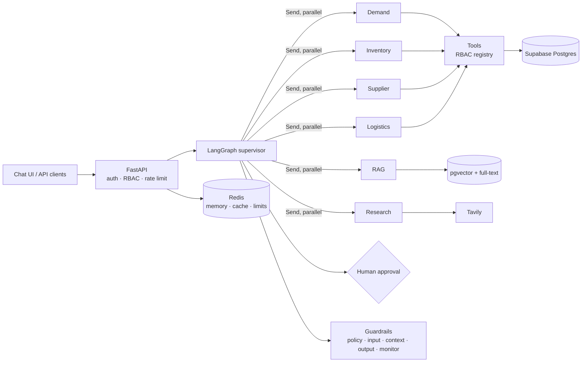

# Multi-Agent Supply Chain AI System

A production-style GenAI system for supply chain operations. A **LangGraph supervisor** routes questions to
specialist agents. Each agent works only through RBAC-checked tools over PostgreSQL data, plus a
**RAG knowledge base** (pgvector, hybrid search, citations). Every stage is protected by guardrails.

> **Status: Phase 0 (scaffold).** See [docs/PLAN.md](docs/PLAN.md) for the roadmap. Features below are
> marked ✅ (done) or 🔜 (planned).

## Example questions

- "Which products are at risk of stockout?"
- "How much should we reorder for SKU-100?"
- "Which supplier should we select for SKU-100?"
- "Which shipments are delayed?"
- "What does our procurement policy say about single-source suppliers?"
- "Give me a complete recommendation for SKU-100." (This runs the demand, inventory, supplier, logistics and
  RAG agents in parallel, and adds a human-approval step for large PO drafts.)

## Architecture



More detail: [docs/architecture.md](docs/architecture.md) · agent specs: [agents/](agents/)

## Tech stack

- **Core:** Python 3.12, FastAPI, LangChain, LangGraph
- **Data:** PostgreSQL + pgvector (Supabase), Redis
- **LLMs:** OpenAI-compatible providers. Euri is the primary, with Groq and Gemini as fallbacks.
- **Search and OCR:** Tavily, Tesseract OCR
- **Monitoring:** Prometheus, Grafana, LangSmith, CloudWatch
- **Delivery:** Docker, Kubernetes (EKS), Terraform, GitHub Actions

## Getting started (development)

```bash
uv sync                      # creates .venv with Python 3.12
cp .env.example .env         # then fill in keys (never commit .env)
uv run pytest                # offline tests
uv run ruff check . && uv run ruff format --check .
```

Running everything with `docker compose up` arrives in Phase 6.

## Repository layout

| Path | Contents |
|---|---|
| `app/` | Application code: api, agents, tools, services, rag, guardrails, db, core, models |
| `agents/` | Agent specifications |
| `docs/` | Plan and architecture |
| `migrations/` | Alembic migrations |
| `scripts/` | Seed data and sample-document generators |
| `evals/` | Evaluation harness and golden datasets |
| `tests/` | Tests: unit, integration, agents, tools, rag, evaluation |
| `deploy/`, `infra/` | Kubernetes, Grafana and Prometheus config, and Terraform |

## Security

- Secrets come only from environment variables. `.env` is gitignored.
- See [CLAUDE.md](CLAUDE.md) for the engineering rules, and [docs/PLAN.md §4](docs/PLAN.md) for the guardrail
  design. It covers PII and HIPAA profiles, prompt-injection defence, tool authorization and audit logging.
