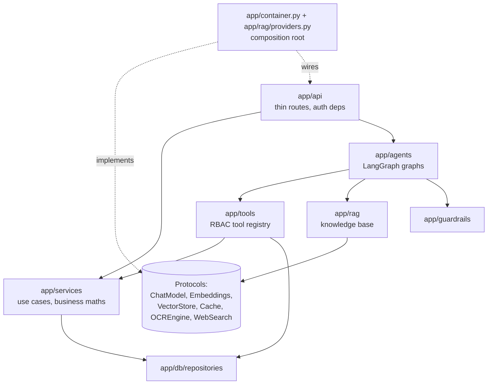
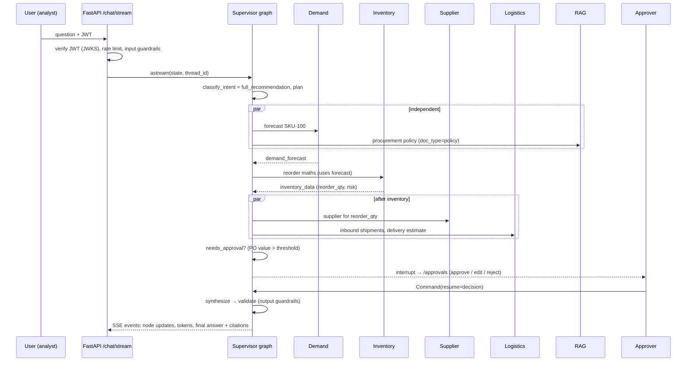
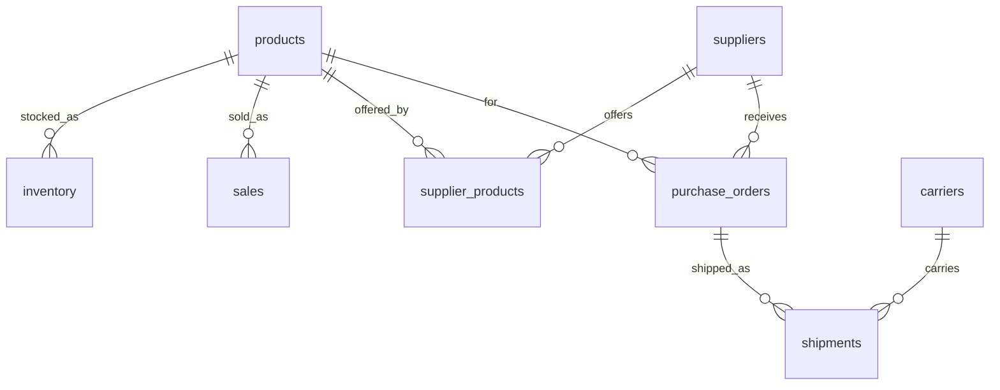
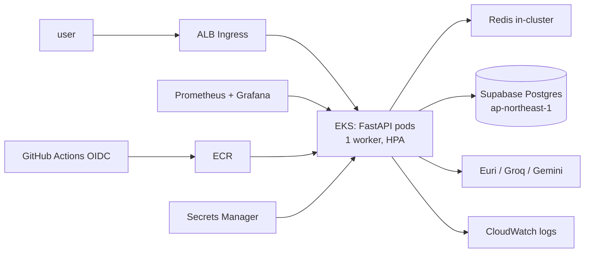

# Architecture

Companion to [PLAN.md](PLAN.md), which holds the decisions and roadmap. Agent specifications are in
[../agents/](../agents/).

## 1. Layers and dependency direction

Dependencies point inward only. Concrete providers (LLMs, Redis, Tavily, Tesseract) are constructed in one
place, `app/container.py`. FastAPI hands them to routes through `Depends`. Tests swap in fakes.

## 2. Question flow: "Give me a complete recommendation for SKU-100"

## 3. Data model (operational)

Knowledge-base tables:

- `kb_sources`, the hash registry with chunk ids
- `kb_chunks`, holding the embedding, the `tsvector` and the JSONB metadata
- `kb_version`

The other tables are:

- conversation memory: `conversations` and `messages`
- `approvals`
- `audit_log`
- the LangGraph checkpointer tables

## 4. Deployment (target)

Local development uses `docker compose`, which runs the app and Redis and connects to Supabase. Optional
profiles add a local pgvector database and a monitoring stack.
